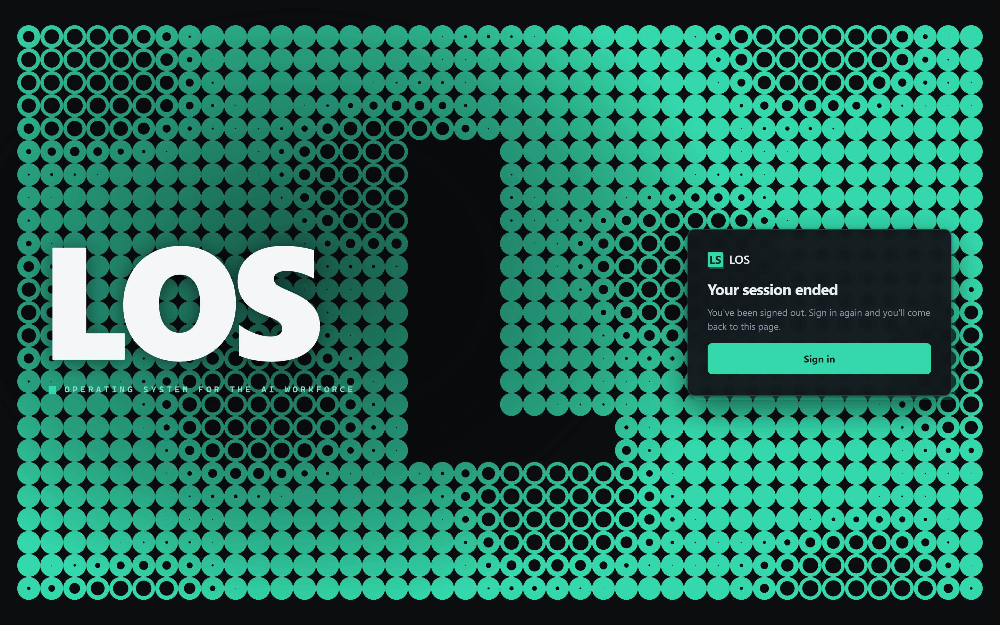
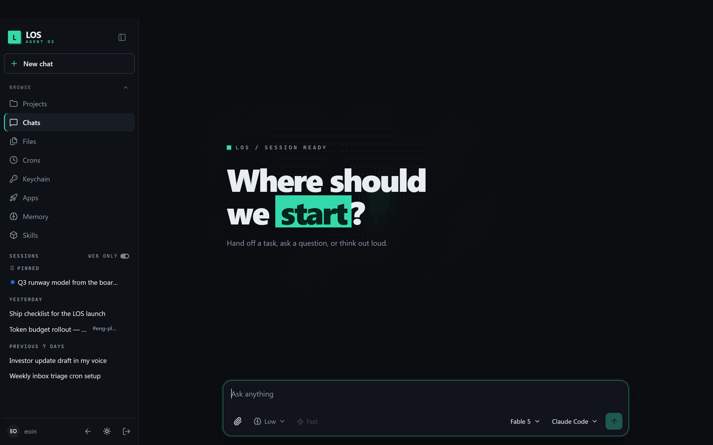
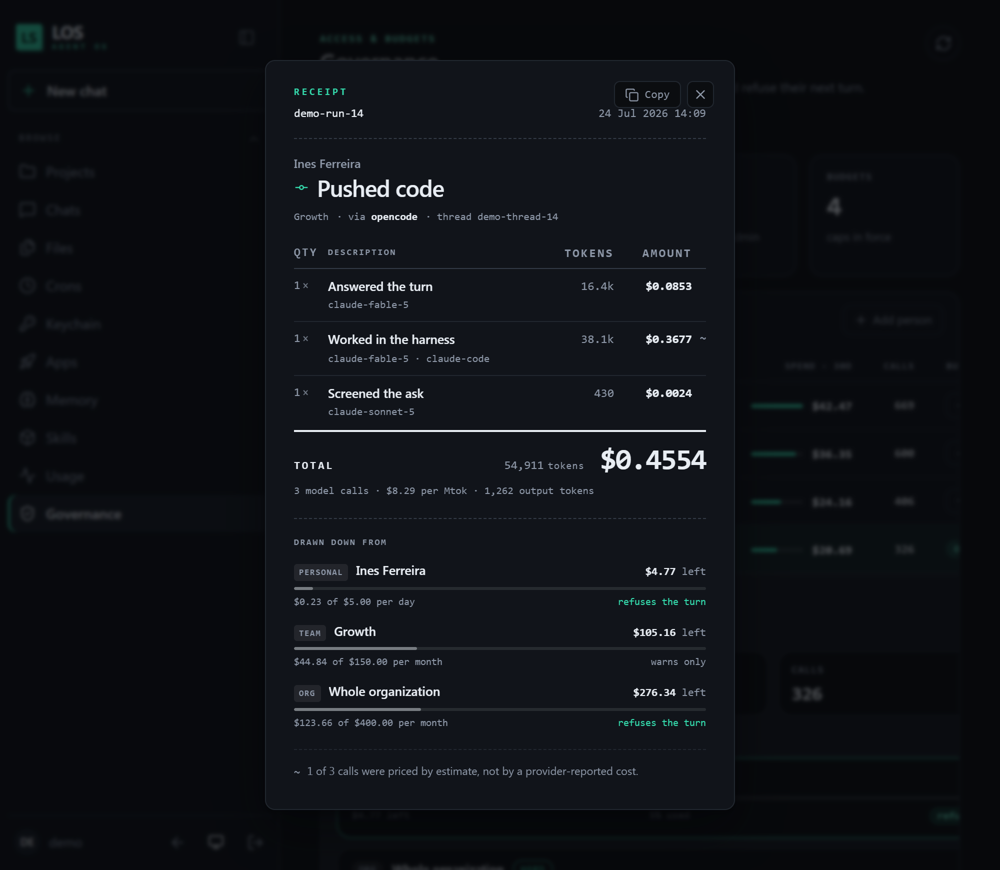
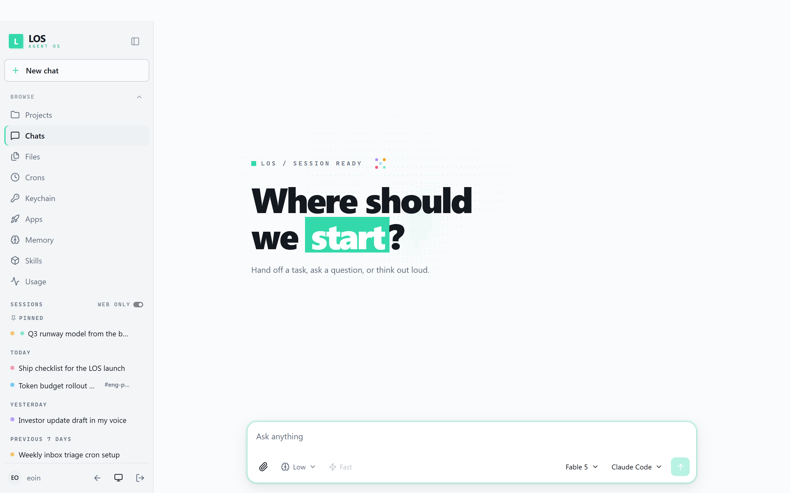
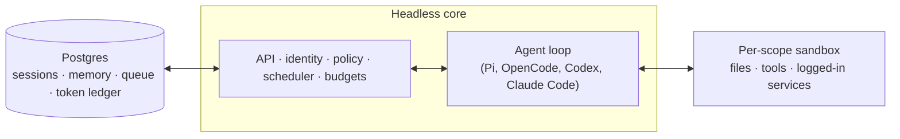

# LOS — Line of Sight

**The operating system for your AI workforce.** One place to run, govern, and — down
to the token — see all of it.



LOS gives every person in your company their own AI worker — with its own memory, files,
credentials, schedule, and computer — and gives the company one place to run, govern, and
meter all of them. In Slack and on the web. Self-hosted, MIT-licensed, in your own cloud.



## Why LOS exists

Most AI tools are either a chatbox that forgets you, or a personal agent that can't be
trusted with a company. The chatbox scales to an org but does nothing real; the personal
agent does real work but answers to one person, holds their credentials in plain sight,
and multiplies into an ungoverned fleet the day your teammates copy it.

LOS is what you get when you design for the whole company from the first line. Every
employee gets an isolated workspace: their agent remembers _them_, holds _their_ keys,
runs _their_ crons, and works on a durable computer where installed tools stay installed.
Every Slack channel and project gets a shared scope with its own memory and files, so the
agent in `#launch-week` knows what `#launch-week` knows — and nothing it shouldn't.
Admins set the security posture, the model roster, and — uniquely — the token budget for
all of it, enforced in the execution path, not discovered on an invoice.

## What your team does with it

- Ask anything against your company's knowledge, files, and the web — in a DM or a channel
- Hand it real work: run tests, open PRs, watch CI, check logs, in an isolated sandbox
- Build internal web apps in conversation and publish them to exactly the right people
- Teach it your writing voice, then let a cron triage your inbox with drafts ready to send
- Track a project in a shared channel where the agent posts updates and follow-ups
- Capture a workflow once as a **skill**, share it with your team, promote it org-wide

## The Unified Token Budget

AI spend is the new cloud bill: unit prices fall, agentic consumption explodes, and the
invoice arrives with no story attached. Cost-monitoring products watch this happen from
the outside — they read provider billing metadata after the fact, attribute it to an API
key, and email you when it's too late.

LOS meters _inside_ the execution path, which changes what's possible:

- **Exact, per-call accounting.** Every model call lands in a durable ledger with true
  input/output/cache token counts and harness-reported cost — by model, phase, person,
  scope, session, and run. Not estimates. Not samples. Everything.
- **Budgets that enforce.** Allocations attach to the org, to teams (nested, aggregating
  their sub-teams), or to individuals. A soft allocation warns; a hard allocation
  **refuses the turn**. The cap is a stop, not a notification.
- **A receipt for every run.** Because LOS runs the work, spend attaches to what was
  produced. Open any run and get an itemised receipt: each model call by phase, model
  and engine, the true token counts, the outcome it produced — code pushed, artifact
  shipped, sent internally, chat — and the budget stack it drew down, personal through
  team to org, with what's left on each. Calls priced by estimate rather than by a
  provider-reported cost are marked as such. "Why did this cost $0.46?" has an answer
  you can paste into Slack.
- **The numbers that matter.** Effective $/MTok, cache-hit share, per-employee-per-month
  spend, and estimated-vs-exact coverage, per team and per person, from
  `GET /v1/admin/utb`. Every employee sees their own meter at `GET /v1/usage` before
  anyone else sees a leaderboard.



Teams and allocations are managed live over the admin API:

```
PUT /v1/admin/utb/teams        { "id": "eng", "name": "Engineering", "members": ["ada", "lin"] }
PUT /v1/admin/utb/allocations  { "id": "eng-monthly", "subject": "team:eng",
                                 "limitUsd": 500, "windowMs": 2592000000, "hard": true }
```

## Pick your engine

LOS is a harness, not a model wrapper — and it refuses to marry your company to one
vendor. Pi, OpenCode, Codex, and Claude Code all drive the same core, behind one fixed
tool surface and one policy layer. Switch engines per turn, per scope, or org-wide;
your memory, files, skills, budgets, and audit history don't move an inch.

## Security that assumes the worst

- **Postures, not vibes.** One org-wide floor — `strict` (a human approves every tool
  call), `auto` (a classifier screens externally-sourced content for prompt injection
  before the model sees it), or `dangerous` — which narrower scopes can only tighten.
- **A command policy that never sleeps.** Recursive deletes, force-pushes, destructive
  SQL, and `curl | sh` require approval in _every_ posture, `dangerous` included. The
  scanner unwraps quoting, encoding, and nested shells before matching.
- **Isolation as architecture.** Each scope's sandbox is its own computer. Egress runs
  through a policy proxy that hard-blocks cloud metadata endpoints. Credentials live in
  a keychain, delivered per-turn, never written to disk in the clear.
- **Memory that can't be poisoned quietly.** Facts captured from untrusted sources are
  rewritten to read as claims, with provenance, before they're stored.
- **Everything audited.** Turns, tool calls, approvals, screen verdicts, egress, admin
  reads — including who looked at whose spend.

## Designed like a product, not a dashboard

Dark-first, near-black surfaces with elevation done by light, not shadow; one electric
accent used only where it means something; a calm, paper-toned light mode; full-width
transcript rows that read like a document instead of a bubble fight. The entire system
derives from design tokens, and the accent re-derives from your org's brand color at
runtime — one env var and the whole interface is yours.



## Run it locally

Requires Node ≥ 24.15 and Docker (for the local sandbox and optional Postgres).

```bash
npm install
npm run init:env            # writes .env from .env.example and generates the five
                            # signing secrets; then set ADMIN_GRANTS=<your-sign-in-id>:org_admin
npm run dev                 # core on :8080

cd plugins/web-ui
npm install && npm run build
npm run serve               # web UI on :8096
```

`ADMIN_GRANTS` mints the first org admin. Without it nobody holds a grant, and Governance
and Usage tell you to ask an org admin who does not exist yet. To skip granting yourself,
run `npm run init:env` (the signing secrets are still required) and boot with
`LOS_DEMO=1 npm run dev` and `WEB_UI_DEMO=1 npm run serve`: the instance
seeds teams, budgets and 30 days of usage, and the web UI signs you in as an org admin.

Without `DATABASE_URL`, LOS runs fully in-memory — perfect for kicking the tires.
Point `DATABASE_URL` at Postgres and sessions, runs, crons, memory, audit, and the
token ledger all become durable.

## Architecture



One headless core owns every turn: identity, policy, budget check, harness dispatch,
delivery. Every substrate — harness, sandbox, session store, memory, ledger — sits
behind an interface with an in-memory dev implementation and a production one, selected
in a single wiring file. Surfaces are plugins over the core's HTTP API: the web UI, the
admin panel, and the public portal are separate processes that never import core; Slack
runs in-process and hot-reloads when the installation changes. Everything specific to
one company lives in a deployment directory that the [`qm` CLI](./cli/README.md)
validates and deploys to your own Fly.io or AWS account.

## The rest of the company's AI, not just ours

A harness that only meters itself is a partial answer, because your people are already
using Claude Code, ChatGPT, Codex and the rest. LOS ingests those too: point any
OpenTelemetry GenAI exporter at `POST /v1/ingest/otel` and that spend lands in the same
ledger, under the same budgets, split by `source` so you can see LOS work beside
everything else. The same convention exports outward — Langfuse, Datadog, Grafana —
so LOS doesn't ask you to abandon the observability stack you already run.

Memory imports the same way: bring your Claude and ChatGPT conversations and your
Obsidian vault, and the facts worth keeping are distilled into the agent's memory —
with anything from an untrusted source rewritten to read as a claim, with provenance,
before it is ever stored.

## Roadmap

- **Routing governance.** Frontier-model use outside an allowance pauses for a one-line
  justification through the same approval machinery the strict posture already uses.
- **More surfaces.** Discord and iMessage alongside Slack and the web.
- **Enterprise identity.** SCIM provisioning, SAML, exportable audit.

## Going deeper

- [`docs/getting-started.md`](./docs/getting-started.md) — deploy for an organization
- [`adrs/`](./adrs) — design records, including the Unified Token Budget and
  observability strategy
- [`.env.example`](./.env.example) — every knob, documented in place
- [`SECURITY.md`](./SECURITY.md) — threat model and operator assumptions

## Lineage and license

LOS is a downstream fork of [QM](https://github.com/yc-software/qm), the multiplayer
agent harness open-sourced by Y Combinator, and tracks its core. Except where otherwise
noted, LOS is available under the [MIT License](./LICENSE).
